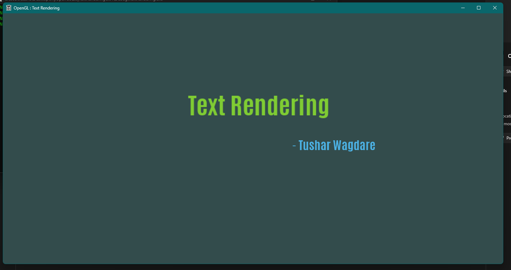

# OpenGL Text Rendering with FreeType

This repository demonstrates how to render text using OpenGL with the help of the FreeType library. It provides a practical implementation for displaying text in your OpenGL applications, including handling different font types and sizes.

## Overview

This project focuses on:

*   **Text Rendering:**  Demonstrates how to load font data using FreeType, generate texture atlases, and render characters on the screen in OpenGL.
*   **Font Management:** Provides the tools to manage different font files and settings within your OpenGL application.

## Screenshot

Here's a screenshot showing the text rendering in action:

## Folder Structure

The repository is organized as follows:

*   **`TextRendering/x64/Debug`:**  Debug build output directory for the Text Rendering example.
*   **`resources`**: Contains the necessary resources such as fonts and shaders.
*   **`shaders`**:  Contains shader source files used for rendering the text.
*   **`x64/Debug`:**  General debug build output directory.
*   `.gitignore`: File for excluding untracked files in git.
*   `Logger.h`: Header file for a simple logger class
*   `MyIcon.ico`: Icon file.
*   `OGL.cpp`:  Main source file of the OpenGL application.
*   `OGL.rc`: Resource script file for windows.
*    `OGL.sln`: Visual studio solution file.
*   `OGLvcxpj`: Visual studio project file.
*   `OGLvcxpj.filters`:  Filter for the Visual Studio project
*   `Resource.h`: Header file for resources.
*   `Screenshot 2025-01-31 163515.png`: Sample Screenshot.
*   `Shader.h`: Header file for handling shaders
*   `Timer.h`: Header file for a simple timer.
*   `WindowManager.cpp`: Cpp file for managing the window
*   `WindowManager.h`: Header file for the window manager.
*  `camera.h`: Header file for camera class
*  `mesh.h`: Header file for mesh class
*   `model.h`: Header file for the model class
*  `targetver.h`: Header file for the target windows version.

## TODO (Future Improvements)

*   Add support for different font styles (e.g., bold, italic).
*   Include multi-line text rendering and word wrapping.
*   Implement more advanced text effects.
*   Add a more flexible resource management.
*   3D text rendering.
